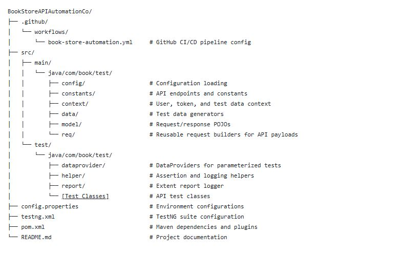
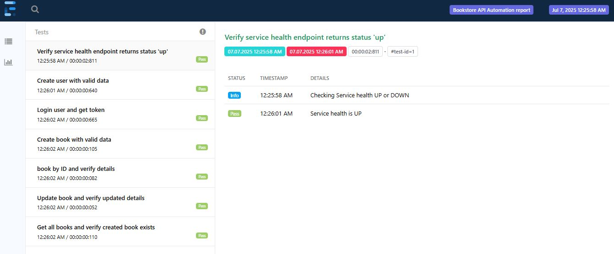

# 📚 - BookServe QA Framework

This project is an **API automation framework** built to validate the core functionalities of a **FastAPI-based BookStore application**. It ensures comprehensive test coverage across CRUD operations, error handling, and authentication flows, with detailed reporting and CI integration.

## 🔧   Tools & Framework Components
- **Java (17)**: Core programming language for framework logic
- **RestAssured**: RESTful API automation and validation
- **TestNG**: Test execution and configuration management
- **ExtentReports**: Generation of interactive HTML test reports
- **Maven**: Project build, dependency, and lifecycle management
- **GitHub Actions**: CI/CD pipeline for automated testing and deployment

## 📊 Validation Scope

The framework covers the following test scenarios for Health check, User and Book Apis:
- ✅ **Expected Behavior Cases**
  - Check service health
  - User sign-up and login with valid credentials
  - Create a new book with valid data
  - Retrieve all books
  - Retrieve a book by ID
  - Update a book
  - Delete a book
- ❌ **Adverse Condition Validations**
  - Create book with missing or invalid fields (e.g., null/empty name or author)
  - Access APIs with invalid or missing tokens
  - Attempt to update or delete non-existent books
  - Sign-up/login with invalid credentials
- 🔗 **Request Chaining**
  - The access token from the login API is dynamically injected into subsequent requests (e.g., create/update/delete book).

## 📘 Quality Assurance Strategy

### 🧪 1. **API Test Case Architecture**
- Designed modular test classes for each resource: User, Book, and Health.
- Used TestNG’s @DataProvider to run the same test with multiple invalid input combinations.
- Applied dependsOnGroups to manage cross-class dependencies (e.g., Book tests depend on successful user login).
- Implemented request chaining: token from login is reused for authenticated endpoints like create/update/delete book.
- Used POJOs for request/response mapping to ensure type safety and clarity.

### 🧰 2. **System Robustness & Serviceability**
- Centralized configuration using config.properties for base URL and tokens.
- Separated concerns: test logic, request specs, data generators, and reporting are in distinct packages.
- Assertions validate status codes, response structure, and error messages.
- Included both positive and negative test cases for each endpoint.
- Used reusable helper methods for logging, token management, and error validation.
- Implemented BaseTest & Listeners to initialize ExtentReports and manage test lifecycle hooks.

### 🧠 3. **Challenges & Solutions**
| Challenge                                                                   | Solution                                                                    |
|-----------------------------------------------------------------------------|-----------------------------------------------------------------------------|
| APIs returned 500 instead of 422 for invalid input. those cases are failing | Validated payloads and added assertions to catch backend issues             |
| APIs returned 400 with msg but not mentioned in swagger                     | Mention all the API response code in swagger                                |
| Token reuse across tests                                                    | Used a context class to store and inject the token dynamically              |
| Managing test data collisions                                               | Validated payloads and added assertions to catch backend issues             |
| No Delete Api for user, which increases the test users                      | Provide API for delete users or test cases to maintain first created users. |
| Cross-class test dependencies                                               | Switched from dependsOnMethods to dependsOnGroups for better control        |
| No Validation for input request. creating with empty email, book name etc   | Fix to be done on application                                               |

## ⚙️CI/CD Pipeline

### 🔁  Trigger:  
Runs on **every push** and **pull request** to `main`.

### 🚀 Steps in CICD process:
- Checkout code
- Setup Java (Temurin 17)
- Build and run tests via Maven
- Upload test reports:
  - Surefire Reports (TestNG)
  - ExtentReports (HTML)

### 🧱 Framework Structure

### ▶️How to Run the Tests
- Prerequisites
- Java 17+
- Maven 3.6+
- Git

###  💻  Clone the repo in the required directory on your PC if you want to run locally:
- Clone the repository:
  git clone https://github.com/Nagaraju-J/BookStoreAPIAutomation.git
  cd bookstore-api-automation
- Update config.properties with the correct base URL:
  url=http://localhost:8000
- Run the test suite:
  mvn clean test
- View the report: Open the generated HTML report at:
  test-output/ExtentReport.html
  
### 📈 Sample Report

- A sample Extent Report is generated after every test run, showing:
- Test name and description
- Pass/Fail/Skip status
- Request/response logs
- Assertion results

## 👁️ How to View GitHub Actions Reports
Go to repo URL (https://github.com/Nagaraju-J/BookStoreAPIAutomation.git) → Actions
Click on the latest workflow run.
Scroll to Artifacts.

Download-

Extent Report (ExtentReports.html)

Surefire Report

## 🤝  Contributing to repo:
Fork the repo

Create your feature branch (git checkout -b feature/story_numbers)

Commit and push

Submit a pull request

## ✍️Authors
Nagaraju Jampani
